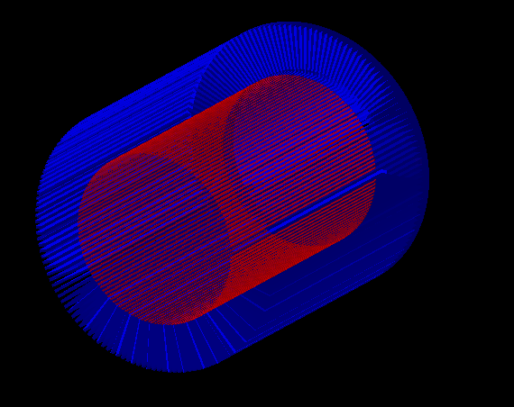
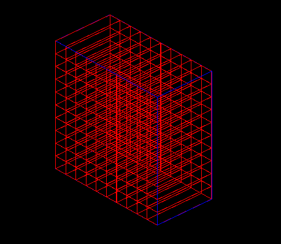
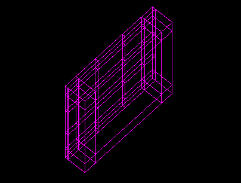

# Geant4中如何添加复杂组件

## 1. bool 运算

```c++
#include "G4SubtractionSolid.hh"

 G4SubtractionSolid*	Tsubtraction = new G4SubtractionSolid("PipeWall-Strips",solidPWall,solidStrips,rotz0,G4ThreeVector());
```

用例：

```c++
 //=====================================
  // 圆柱形准直器
  //
  double I_R1=90.0*mm;//,I_R2=100.0*mm;
  //double O_R1=97.1*mm,O_R2=107.1*mm;
  double O_R1=140.0*mm;//,O_R2=135.4*mm;
  double C_z =150.0*mm;

  pSPhi= 0.*degree;
  pDPhi= 360.*degree;

  G4Tubs* solidCol =   
    new G4Tubs("Collimator",     I_R1, O_R1,C_z,pSPhi,pDPhi);     //its size


  //====================================
  // void in collimator
  pSPhi = 0.;
  pDPhi = 2.0*pi/(90.0*pi);

  G4Tubs* solidVoidC = new G4Tubs("VCollimator",I_R1-0.1*mm, O_R1+0.1*mm,C_z+0.1*mm,pSPhi,pDPhi);

  // G4SubtractionSolid* subtraction[94];
  G4SubtractionSolid* subtraction[141];

  for(int i=1;i<=141;i++){
    G4RotationMatrix* rotz= new G4RotationMatrix;
    rotz->rotateZ(-2*i*2.0*pi/(90.0*pi));

    if(i==1)
      subtraction[0]=
  	new G4SubtractionSolid("Collimator-Void", solidCol, solidVoidC,rotz,G4ThreeVector(0.0*mm,0.0*mm,10.0*mm));
    else
      subtraction[i-1]=
  	new G4SubtractionSolid("Collimator-Void", subtraction[i-2], solidVoidC,rotz,G4ThreeVector(0.0*mm,0.0*mm,10.0*mm));
  }


  G4LogicalVolume* logicCol =                         
    new G4LogicalVolume(subtraction[140],          //its solid
                        col_mat,           //its material
                        "Collimator");            //its name

  G4PVPlacement* physCol = 
    new G4PVPlacement(0,                     //no rotation
                      G4ThreeVector(0.*mm,0.*mm,160.0*mm),//65.0*mm),       //at (0,0,0)
                      logicCol,              //its logical volume
                      "Collimator",                 //its name
                      logicWorld,            //its mother  volume
                      false,                 //no boolean operation
                      0,                     //copy number
                      checkOverlaps);        //overlaps checking

```

建出来的结果：圆柱形准直器




## 2. Assemble组件

闪烁体pixel阵列构建代码：

```c++
  //*************************************************     
  // AssembleNBD World
  //*************************************************
  G4double sizeXY = 100.77*mm+2.*mm;
  G4double sizeZ  = 100.14*mm;

  G4Box* solidAssembleNBD =   
    new G4Box("AssembleNBD",     0.5*sizeXY, 0.5*sizeXY, 0.5*sizeZ);     //its size
  
  logicAssembleNBD =                         
    new G4LogicalVolume(solidAssembleNBD,          //its solid
                        world_mat,           //its material
                        "AssembleNBD");            //its name


  //***************
  //test for one NBD

  physAssembleNBD = 
    new G4PVPlacement(0,                     //no rotation
                      G4ThreeVector(0.0*cm,0.0*cm,-85.007*cm),       //at (0,0,0)
                      logicAssembleNBD,      //its logical volume
                      "physAssembleNBD",         //its name
                      expHall_logV,          //its mother  volume
                      false,                 //no boolean operation
                      0,                     //copy number
  		      checkOverlaps);        //overlaps checking

  //*************************************************
  // EJ200 scintillator
  //*************************************************
  //
  //      ------------- Volumes --------------
  //  10X10X50 mm3 EJ-200/BC408
  //  spacing is 65 um between two EJ-200 with reflector
  //  

  //  
  // EJ200 reflector box
  //----------------------------------
  // 100.770X100.770X50.070 mm3
  // 10X10+0.07*11; 50 + 0.07

  G4double ej200_x=10*mm, ej200_y=10*mm, ej200_z=50*mm; //full size of ej200
  G4double rowNb_ej200=10, colNb_ej200=10; // 10X10 ej200
  G4double gap=0.070*mm; // gap between two ej200

  G4double EJ200_Box_x = ej200_x*rowNb_ej200/2+gap*(rowNb_ej200+1)/2;
  G4double EJ200_Box_y = ej200_y*colNb_ej200/2+gap*(colNb_ej200+1)/2;
  G4double EJ200_Box_z = (ej200_z+gap)/2;

  //  mother volume of 10 X 10  EJ200  
  G4double Assemble_x = EJ200_Box_x; 
  G4double Assemble_y = EJ200_Box_y;
  G4double Assemble_z = EJ200_Box_z;

  G4Box* Assemble_solidV = new G4Box("Assemble_solidV", 
  			Assemble_x, Assemble_y, Assemble_z);
  Assemble_logV  = new G4LogicalVolume(Assemble_solidV, ESR, "Assemble_logV",0,0,0);

 G4double Assemble_px = 0;  // put it at (0,0, EJ200_Box_z)
  G4double Assemble_py = 0;
  G4double Assemble_pz = EJ200_Box_z;  
  Assemble_physV = new G4PVPlacement(0,
                             G4ThreeVector(Assemble_px, Assemble_py, Assemble_pz),
                             Assemble_logV,
                             "Assemble_physV",
                             logicAssembleNBD,
                             false,
                             0);

  //
  // each EJ-200
  //-------------------------------

  G4double EJ200_x = ej200_x/2;  // half size
  G4double EJ200_y = ej200_y/2;
  G4double EJ200_z = ej200_z/2;

  G4Box* EJ200_solidV = new G4Box("EJ200_solidV", EJ200_x, EJ200_y, EJ200_z);
  EJ200_logV = new G4LogicalVolume(EJ200_solidV, EJ200, "EJ200_logV",0,0,0);


  // create Assembly of EJ200 array Box
  //
  G4AssemblyVolume* assemblyEJ200 = new G4AssemblyVolume();

  // Rotation and translation of the logical volume
  G4RotationMatrix rotationMatrixEJ200; 
  G4ThreeVector positionEJ200(0., 0., 0.);
  G4Transform3D transform3DEJ200;

  // Fill the assembly by EJ200
  //
  G4int max_x = rowNb_ej200; 
  G4int max_y = colNb_ej200;
  for(G4int x_row_num = 0; x_row_num < max_x; x_row_num++ ){
    for(G4int y_col_num = 0; y_col_num < max_y; y_col_num++ ){  
      positionEJ200.setX( -EJ200_Box_x + (x_row_num+1)*gap + (2*x_row_num+1)*EJ200_x );
      positionEJ200.setY( -EJ200_Box_y + (y_col_num+1)*gap + (2*y_col_num+1)*EJ200_y );
      positionEJ200.setZ( 0.0*mm );
      transform3DEJ200 = G4Transform3D(rotationMatrixEJ200, positionEJ200);
      assemblyEJ200->AddPlacedVolume(EJ200_logV, transform3DEJ200);
    }
  }  

  // Place the Assembly
  //
  positionEJ200.setX(0.0 ); positionEJ200.setY(0.0 ); positionEJ200.setZ(-0.5*gap);
  transform3DEJ200 = G4Transform3D(rotationMatrixEJ200, positionEJ200);
  assemblyEJ200->MakeImprint(Assemble_logV, transform3DEJ200);
```

闪烁体探测器芯块阵列：



## 3. Parameterised

光导构建代码：

```c++
#include "G4PVParameterised.hh" //得包含G4PVParameterised头文件

  //
  // Light Guide top mother volume
  //-------------------------------------

  // The defination of light guide
  // define mother volume of light guide
  // half size of volume
  G4double LightGuide_x = ej200_x*rowNb_ej200/2+gap*(rowNb_ej200+1)/2; 
  G4double LightGuide_y = ej200_y*colNb_ej200/2+gap*(colNb_ej200+1)/2;
  G4double LightGuide_z = 3*mm/2;
  gap = 0.07*mm; // gap between the boxes which is used to put
          		  // the reflector 
  G4Box* LightGuide_top_motherV = new G4Box("LightGuide_top_motherV",
                                LightGuide_x, LightGuide_y, LightGuide_z);
  LightGuide_top_mother_logV = new G4LogicalVolume(LightGuide_top_motherV,
                                ESR, // ESR reflector
                                "LightGuide_top_mother_logV", 0, 0, 0);
  LightGuide_top_mother_physV = new G4PVPlacement(0,
        G4ThreeVector(0, 0, (grease_pz-grease_z)-LightGuide_z),
        LightGuide_top_mother_logV,
        "LightGuide_top_mother_physV",
        logicAssembleNBD,
        false,
        0);

  //
  // Light Guide top 
  //-------------------------------------------

  // top part of light guide
  // it consists of 5X5 boxes with same height
  // TopX => x of each box in the top part, 
  // TopY => y of each box in the top part,
  // TopHeight => height of each box, they are same.

  // here, the value is the full size of box
  G4double TopX[5] = {12.3*mm, 22.3*mm, 31.15*mm, 22.3*mm, 12.3*mm};
  G4double TopY[5] = {12.3*mm, 22.3*mm, 31.15*mm, 22.3*mm, 12.3*mm};
  G4double TopHeight = 3.0*mm;

  G4int rowNb = 5;
  G4int colNb = 5;

  G4double TopGap = gap; // ESR materials
  G4double x0, y0; // coordinate of the left bottom corner
  x0 = -LightGuide_x;
  y0 = -LightGuide_y;
  // left bottom conner of X-Y plane (-A, -A)
  // this box is a seed of other boxes
  G4Box* LightGuide_top_solidV = new G4Box("LightGuide_top_solidV",
           		TopX[0]/2, TopY[0]/2, TopHeight/2);

  LightGuide_top_logV = new G4LogicalVolume(LightGuide_top_solidV,
                                        BC800, // light guide material
                                        "LightGuide_top_logV", 0, 0, 0);

  // all the coordinates are relative to the coordinate system of LightGuide_mother_logV 
  G4double LightGuide_top_px = x0;
  G4double LightGuide_top_py = y0;
  G4double LightGuide_top_pz = 0*mm;

  //G4VPVParameterisation 
  APNISLGParameterisation *lightGuide_para_top = 
  		new APNISLGParameterisation(
  				rowNb, colNb, // number of row and column
   				TopX, TopY,
  				TopGap, TopHeight,
  				LightGuide_top_px, LightGuide_top_py, LightGuide_top_pz,
  				BC800, ESR);

  LightGuide_top_physV = new G4PVParameterised("LightGuide_top_physV",
  				LightGuide_top_logV, LightGuide_top_mother_logV,
  				kUndefined, rowNb*colNb, lightGuide_para_top);

  //
  // Light Guide bottom mother volume
  //-------------------------------------------

  // Bottom part of light guide, half size
  G4double LightGuide_z_ = 18*mm/2;
  G4Box* LightGuide_bottom_motherV = new G4Box("LightGuide_bottom_motherV",
                                LightGuide_x, LightGuide_y, LightGuide_z_);
  LightGuide_bottom_mother_logV = new G4LogicalVolume(LightGuide_bottom_motherV,
                                ESR, // ESR reflector
                                "LightGuide_bottom_mother_logV", 0, 0, 0);
  LightGuide_bottom_mother_physV = new G4PVPlacement(0,
        G4ThreeVector(0, 0, (grease_pz-grease_z)-LightGuide_z*2-LightGuide_z_),
        LightGuide_bottom_mother_logV,
        "LightGuide_bottom_mother_physV",
        logicAssembleNBD,
        false,
        0);


  //
  // Light Guide bottom
  //---------------------------------------------

  G4double BottomX[3] = {12.3*mm, 75.89*mm, 12.3*mm};
  G4double BottomY[3] = {12.3*mm, 75.89*mm, 12.3*mm};
  G4double BottomHeight = LightGuide_z_*2;

  G4int rowNb_ = 3;
  G4int colNb_ = 3;

  G4double BottomGap = gap; // ESR materials
  // left bottom conner of X-Y plane (-A, -A)
  // this box is a seed of other boxes
  G4Box* LightGuide_bottom_solidV = new G4Box("LightGuide_bottom_solidV",
                        BottomX[0]/2, BottomY[0]/2, BottomHeight/2);

  LightGuide_bottom_logV = new G4LogicalVolume(LightGuide_bottom_solidV,
                                        BC800, // light guide material
                                        "LightGuide_bottom_logV", 0, 0, 0);


  // all the coordinates are relative to the coordinate system of LightGuide_mother_logV 
  G4double LightGuide_bottom_px = x0;
  G4double LightGuide_bottom_py = y0;
  G4double LightGuide_bottom_pz = 0*mm;

  //G4VPVParameterisation 
  APNISLGParameterisation *lightGuide_para_bottom =
                new APNISLGParameterisation(
                                rowNb_, colNb_, // number of row and column
                                BottomX, BottomY,
                                BottomGap, BottomHeight,
                                LightGuide_bottom_px, LightGuide_bottom_py, LightGuide_bottom_pz,
                                BC800, ESR);
  LightGuide_bottom_physV = new G4PVParameterised("LightGuide_bottom_physV",
                                LightGuide_bottom_logV, LightGuide_bottom_mother_logV,
                                kUndefined, rowNb_*colNb_, lightGuide_para_bottom);

```

光导构建图：

