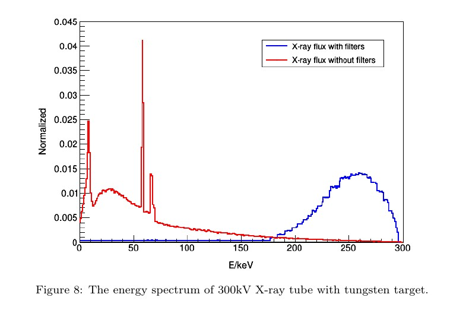
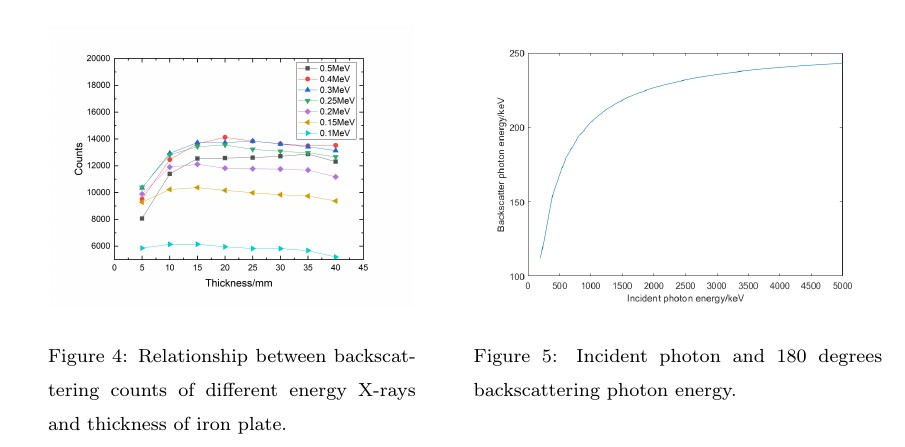
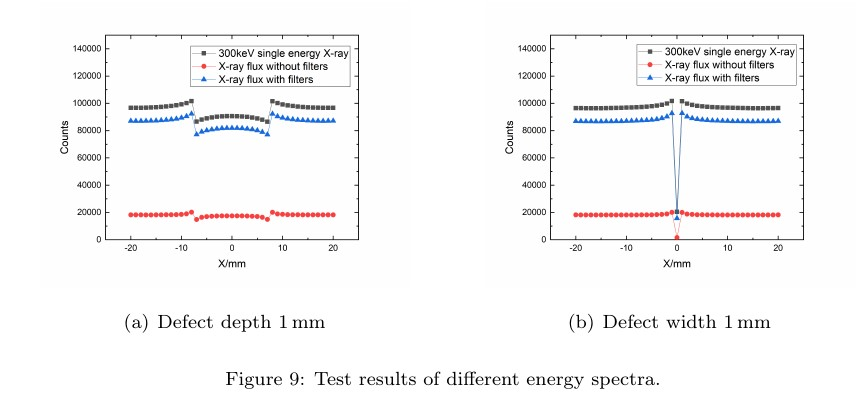

# latex中图片排版问题

## 1.需要包含的头文件

- \usepackage{graphix}
- \usepackage{subfigure}
  - \subfiugre
  - \begin{minipage} ...\end{minipage}

## 2.排版方法
### 2.1 单图排版
```latex
\begin{figure}[htbp]
	\setlength{\abovecaptionskip}{0pt}
	\setlength{\belowcaptionskip}{10pt}
	\centering
	\includegraphics[width=10cm]{./images/c1.png}
	\caption{The energy spectrum of 300kV X-ray tube with tungsten target.}
	\label{fig:spectrum}
\end{figure}
```


### 2.2 并排排版
```latex
\begin{figure}[htbp]
	\begin{minipage}[t]{0.45\linewidth}
		\centering
		\includegraphics[width=0.99\linewidth]{./images/difEnergy.png}
		\caption{Relationship between backscattering counts of different energy X-rays and thickness of iron plate.}
		\label{fig:energy-thickness}
	\end{minipage}
	\hspace{2em}
	\begin{minipage}[t]{0.5\linewidth}
		\centering	
		\includegraphics[width=0.99\linewidth]{./images/BackscatterPhotonEnergy.png}
		\caption{Incident photon and 180 degrees backscattering photon energy.}
		\label{fig:180-energy}
	\end{minipage}
\end{figure}
```



### 2.3 并排子图排版

```latex
\begin{figure}[htbp]
%	\centering
	\subfigure[Defect depth \SI{1}{mm}]{
	\label{fig:fluxResults:a}
	\includegraphics[width=0.45\linewidth]{./images/c1.png}
	}
	\hspace{2em}
	\subfigure[Defect width \SI{1}{mm}]{
		\label{fig:fluxResults:b}
		\includegraphics[width=0.45\linewidth]{./images/c1.png}
	}
	\caption{Test results of different energy spectra.}
	\label{fig:fluxResults}
\end{figure}
```



## 3.总结

- 单图
	- caption设置标题
	- label用于设置引用
- 双图或多图（分别带标题）
  - minipage 设置小页
  - caption设置标题
  - label用于设置引用
- 子图多排
  - subfigure设置子图（解释及子label设置序号）
  - caption设置标题
  - label用于设置引用