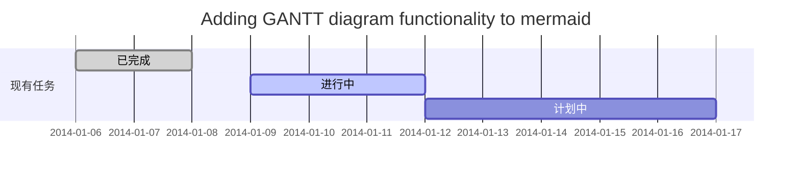
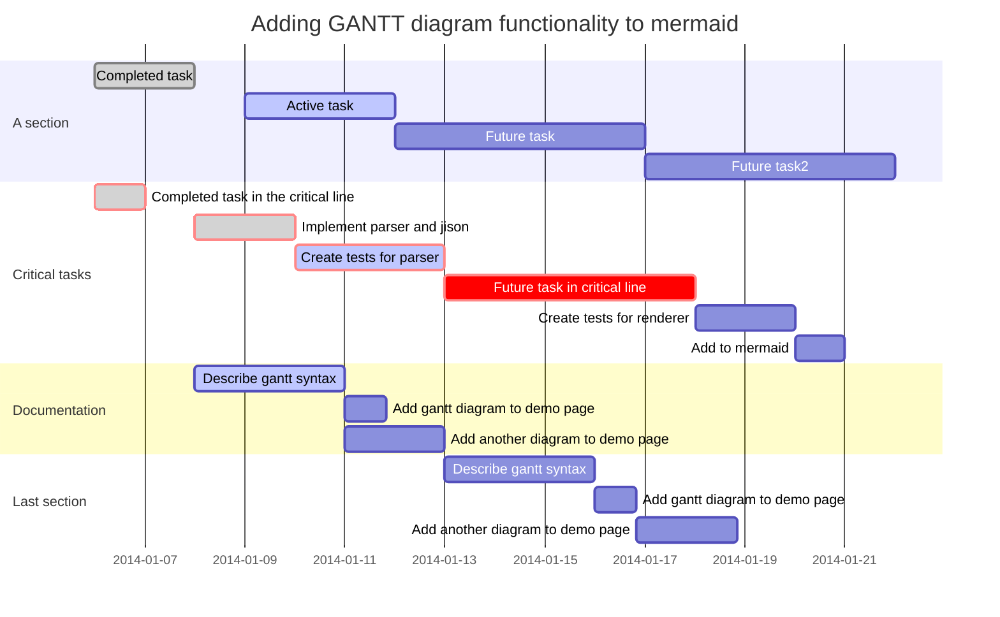
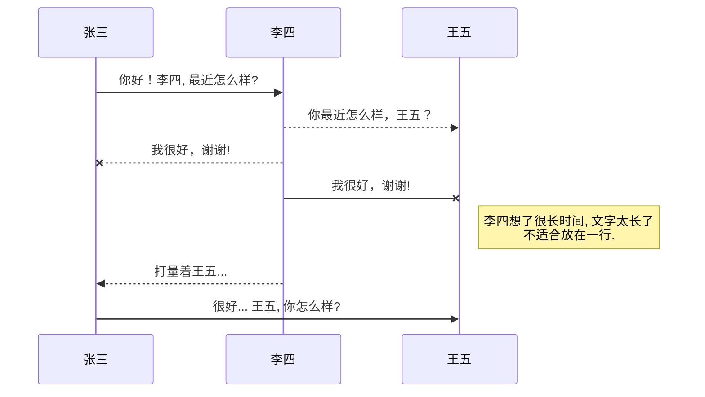
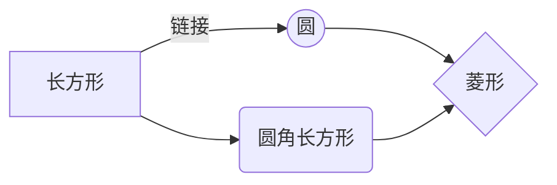
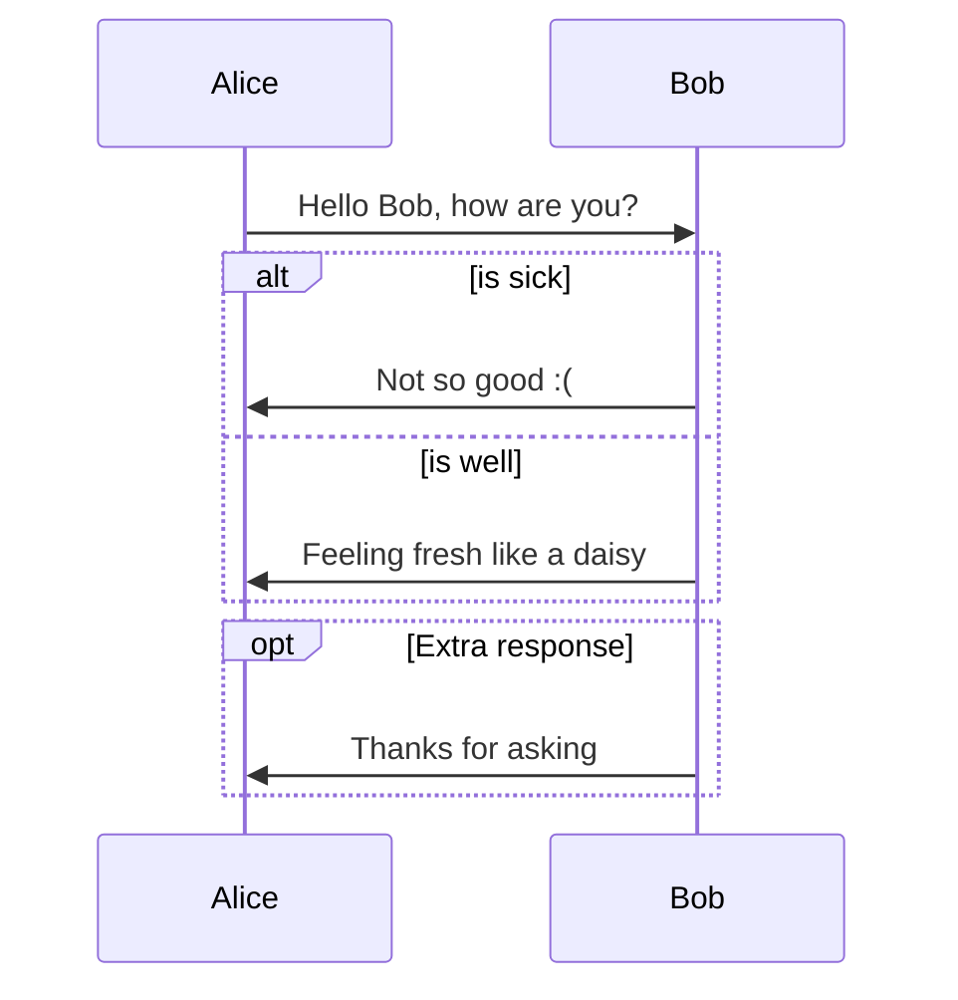

[TOC]

# typora 入门指南

## 1. 简要介绍

typora 是一款所见即所得的Markdown编辑软件。在国外的好用的markdown编辑器排行中，typora以94分的成绩高居榜首。当然，具体的使用需要根据个人习惯来选择，国内推荐比较多的Markdown编辑器就有Atom、dillinger和Marxico等之类的。

## 2. 测试使用体验


- typora能够一键安装，所以，开源免费，官网有丰富的主题可以[下载](https://www.typora.io/)，非常方便，也可以自己定义主题分享到官网供他人使用；

- typora不同于其他markdown编辑器，其采用单栏显示，所见即所得。其他编辑器代码栏与显示栏是分开的。

- 菜单栏有写markdown文件的快捷键，所以在编辑文档时非常方便。 

**缺点**

- [x] 菜单栏的快捷键不够全面， 没有比全面的markdown 帮助文档，全面的markdown帮助文档可以参考CSDN上采用markdown编辑博客的帮助文档。

- [x] 图文展示和代码放一块影响编辑体验。这即是优点又是缺点，不过可以采用`ctrl+\`快速切换到代码块模式。总的来说还是比较方便的。

## Markdown 5分钟快速入门

### 标题

```
# 1级标题

## 2级标题

### 3级标题

#### 四级标题 
 
##### 五级标题  

###### 六级标题
```

==效果展示==


### 文本样式

```
*强调文本* _强调文本_

**加粗文本** __加粗文本__

==标记文本==

~~删除文本~~

> 引用文本

H~2~O is是液体。

2^10^ 运算结果是 1024。
```
==效果展示==

*强调文本* _强调文本_

**加粗文本** __加粗文本__

==标记文本==

~~删除文本~~

> 引用文本

H~2~O is是液体。

2^10^ 运算结果是 1024。


### 列表

```
- 项目
  * 项目
    + 项目

1. 项目1
2. 项目2
3. 项目3

- [ ] 计划任务
- [x] 完成任务
```
==结果展示==

- 项目
  * 项目
    + 项目

1. 项目1
2. 项目2
3. 项目3

- [ ] 计划任务
- [x] 完成任务

### 连接

```
链接: [link](https://mp.csdn.net)
### 将下面的https替换成 https://c-ssl.duitang.com/uploads/item/201702/22/20170222200954_zeJWu.jpeg

图片: 

带尺寸的图片: 

居中的图片: 

居中并且带尺寸的图片: 

typora目前不支持对齐操作，但可以采用HTML语法pdf和网页显示。
<center> 
// 


</center>

这种格式可以实现剧中对齐,但仅限于typora显示


typora中的图片大小设置问题：


<!--or-->


```

==效果展示==

链接: [link](https://mp.csdn.net).

图片: 

带尺寸的图片: 

居中的图片: 

居中并且带尺寸的图片: 

==typora目前不支持对齐操作，但可以采用HTML语法pdf和网页显示。==

<center> 

</center>

这种格式可以实现剧中对齐，但仅限于typora显示
 
==typora中的图片大小设置问题：==


<!--or-->


### 代码片

```
下面展示一些 `内联代码片`。

​```
// A code block
var foo = 'bar';
​```

​```javascript
// An highlighted block
var foo = 'bar';
​```
```

```
// A code block
var foo = 'bar';
```

```javascript
// An highlighted block
var foo = 'bar';
```

### 表格

```
项目     | Value
-------- | -----
电脑  | $1600
手机  | $12
导管  | $1


| Column 1 | Column 2      |
|:--------:| -------------:|
| centered 文本居中 | right-aligned 文本居右 |
```

==效果展示==

| 项目 | Value |
| ---- | ----- |
| 电脑 | $1600 |
| 手机 | $12   |
| 导管 | $1    |


|     Column 1      |               Column 2 |
| :---------------: | ---------------------: |
| centered 文本居中 | right-aligned 文本居右 |

### 自定义列表

```
Markdown
:  Text-to-HTML conversion tool

Authors
:  John
:  Luke
```

==效果展示==

Markdown
<!--:  <iframe height='265' scrolling='no' title='Fancy Animated SVG Menu' src='http://codepen.io/jeangontijo/embed/OxVywj/?height=265&theme-id=0&default-tab=css,result&embed-version=2' frameborder='no' allowtransparency='true' allowfullscreen='true' style='width: 100%;'></iframe>-->

Authors
:  John
: Luke

==暂未找着，可以去typora支持中去寻找答案==

### 注脚

```
一个具有注脚的文本。[^1]

[^1]: 注脚的解释
```

==效果展示==

一个具有注脚的文本。[^1]

[^1]: 注脚的解释

### 注释

```

Markdown将文本转换为 HTML。

*[HTML]:   超文本标记语言

*[HTML]: <span style="color:red">this text is red</span> 
```

==效果展示==

Markdown将文本转换为 HTML。

*[HTML]: <span style="color:red">this text is red</span> 

### Latex数学公式

```
Gamma公式展示 $\Gamma(n) = (n-1)!\quad\forall
n\in\mathbb N$ 是通过 Euler integral

$$
\Gamma(z) = \int_0^\infty t^{z-1}e^{-t}dt\,.
$$
```
==效果展示==
Gamma公式展示 $\Gamma(n) = (n-1)!\quad\forall
n\in\mathbb N$ 是通过 Euler integral

$$
\Gamma(z) = \int_0^\infty t^{z-1}e^{-t}dt\,.
$$

### 插入甘特图

```
​```mermaid
gantt
        dateFormat  YYYY-MM-DD
        title Adding GANTT diagram functionality to mermaid
        section 现有任务
        已完成               :done,    des1, 2014-01-06,2014-01-08
        进行中               :active,  des2, 2014-01-09, 3d
        计划中               :         des3, after des2, 5d
​```
​```mermaid
%% Example with selection of syntaxes
        gantt
        dateFormat  YYYY-MM-DD
        title Adding GANTT diagram functionality to mermaid

        section A section
        Completed task            :done,    des1, 2014-01-06,2014-01-08
        Active task               :active,  des2, 2014-01-09, 3d
        Future task               :         des3, after des2, 5d
        Future task2               :         des4, after des3, 5d

        section Critical tasks
        Completed task in the critical line :crit, done, 2014-01-06,24h
        Implement parser and jison          :crit, done, after des1, 2d
        Create tests for parser             :crit, active, 3d
        Future task in critical line        :crit, 5d
        Create tests for renderer           :2d
        Add to mermaid                      :1d

        section Documentation
        Describe gantt syntax               :active, a1, after des1, 3d
        Add gantt diagram to demo page      :after a1  , 20h
        Add another diagram to demo page    :doc1, after a1  , 48h

        section Last section
        Describe gantt syntax               :after doc1, 3d
        Add gantt diagram to demo page      : 20h
        Add another diagram to demo page    : 48h
​```
```
==效果展示==




### 插入UML图

```
​```mermaid
sequenceDiagram
张三 ->> 李四: 你好！李四, 最近怎么样?
李四-->>王五: 你最近怎么样，王五？
李四--x 张三: 我很好，谢谢!
李四-x 王五: 我很好，谢谢!
Note right of 王五: 李四想了很长时间, 文字太长了<br/>不适合放在一行.

李四-->>张三: 打量着王五...
张三->>王五: 很好... 王五, 你怎么样?
​```
```
==效果展示==

### 插入Mermaid流程图

```
​```mermaid
graph LR
A[长方形] -- 链接 --> B((圆))
A --> C(圆角长方形)
B --> D{菱形}
C --> D
​```

​```mermaid
%% Example of sequence diagram
  sequenceDiagram
    Alice->>Bob: Hello Bob, how are you?
    alt is sick
    Bob->>Alice: Not so good :(
    else is well
    Bob->>Alice: Feeling fresh like a daisy
    end
    opt Extra response
    Bob->>Alice: Thanks for asking
    end
​```
```
==效果展示==


### 插入Flowchart流程图

```
​```flow
st=>start: 开始
e=>end: 结束
op=>operation: 我的操作
cond=>condition: 确认？

st->op->cond
cond(yes)->e
cond(no)->op
​```
```
==效果展示==
```flow
st=>start: 开始
e=>end: 结束
op=>operation: 我的操作
cond=>condition: 确认？

st->op->cond
cond(yes)->e
cond(no)->op
```


### 快捷键

由于不同编辑器快捷键的定义有所不同，快捷键没有统一的标准。使用什么编辑器请了解编辑器的快捷键。

