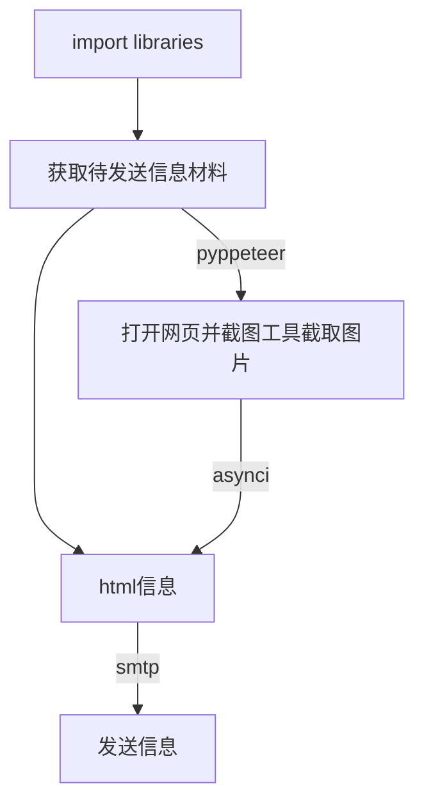

[TOC]

# 如何利用python发送邮件

### 1. python 相关依赖库

说明 ：本文档针对的式利用python 3.7 发送邮件，python发送邮件的相关包比较多，除了SMTP还有POP3和IMAP两种邮件协议。本文档针对的式利用stmp服务器发送邮件

**相关依赖库**

- stmplib
- EmailMessage

### 2. 测试利用smtp发送邮件

```python
import os
import smtplib

EMAIL_ADDRESSS =  "xxx@126.com"
EMAIL_PASSWORD = "xxx"   #邮箱smtp授权码

with smtplib.SMTP('smtp.126.com',25) as smtp:
    
    smtp.login(EMAIL_ADDRESSS,EMAIL_PASSWORD)
    
    subject = 'grab dinner this weekend?'
    body = 'how about dinner at 7pm this saturday?'
    
    msg = f'Subject:{subject}\n\n{body}'
    
    smtp.sendmail(EMAIL_ADDRESSS,'xxx@126.com',msg)
```

### 3. email.message使用

```python
import os
import smtplib
from email.message import EmailMessage

EMAIL_ADDRESSS =  "XXX@126.com"
EMAIL_PASSWORD = "XXX"   #邮箱smtp授权码

msg = EmailMessage()
msg['Subject'] = 'grab dinner this weekend?'
msg['From'] = EMAIL_ADDRESSS
msg['To'] = 'hrbeulh@126.com'
msg.set_content('how about dinner at 7pm this saturday?')


with smtplib.SMTP('smtp.126.com',25) as smtp:
    
    smtp.login(EMAIL_ADDRESSS,EMAIL_PASSWORD)    
    smtp.send_message(msg)
```

### 4.发送给多个用户

```python
import os
import smtplib
from email.message import EmailMessage

EMAIL_ADDRESSS =  "hrbeulh@126.com"
EMAIL_PASSWORD = "XXX"   #邮箱smtp授权码

multi_recipients = ['Fxxx@gmail.com','Mxxx@gmail.com']

msg = EmailMessage()
msg['Subject'] = 'grab dinner this weekend?'
msg['From'] = EMAIL_ADDRESSS
msg['To'] = ','.join(multi_recipients)
msg.set_content('how about dinner at 7pm this saturday?')


with smtplib.SMTP('smtp.126.com',25) as smtp:
    
    smtp.login(EMAIL_ADDRESSS,EMAIL_PASSWORD)    
    smtp.send_message(msg)
```

### 5.Add image attachment

```python
import os
import smtplib
import imghdr
from email.message import EmailMessage

EMAIL_ADDRESSS =  "hrbeulh@126.com"
EMAIL_PASSWORD = "XXX"   #邮箱smtp授权码

msg = EmailMessage()
msg['Subject'] = 'Check out Bronx as puppy!'
msg['From'] = EMAIL_ADDRESSS
msg['To'] = 'hrbeulh@126.com'
msg.set_content('Image attched ...')

with open('P1.png','rb') as f:
    file_data = f.read()
    #file_path = os.getcwd()
    #print(file_path)
    file_type = imghdr.what(f.name)
    #print(file_type)
    #file_name =f.name

msg.add_attachment(file_data, maintype='image',subtype=imghdr.what(f.name, file_data))
#msg.add_attachment(file_data, maintype='image',subtype= filetype, filename = file_name))

with smtplib.SMTP('smtp.126.com',25) as smtp:
    
    smtp.login(EMAIL_ADDRESSS,EMAIL_PASSWORD)    
    smtp.send_message(msg)

```

### 6. Add images attachments

```python
import os
import smtplib
import imghdr
from email.message import EmailMessage

EMAIL_ADDRESSS =  "hrbeulh@126.com"
EMAIL_PASSWORD = "XXX"   #邮箱smtp授权码

msg = EmailMessage()
msg['Subject'] = 'Check out Bronx as puppy!'
msg['From'] = EMAIL_ADDRESSS
msg['To'] = 'hrbeulh@126.com'
msg.set_content('Image attched ...')

files =['P1.png','P2.png','girl.jpeg']

for file in files:
    with open(file,'rb') as f:
        file_data = f.read()
#         file_path = os.getcwd()
#         print(file_path)
#         file_type = imghdr.what(f.name)
#         print(file_type)

    msg.add_attachment(file_data, maintype='image',subtype=imghdr.what(f.name, file_data))
#     msg.add_attachment(file_data, maintype='image',subtype=imghdr.what(None, file_data))

with smtplib.SMTP('smtp.126.com',25) as smtp:
    
    smtp.login(EMAIL_ADDRESSS,EMAIL_PASSWORD)    
    smtp.send_message(msg)

```

### 7. Add pdf attachment 

```python
import os
import smtplib
import imghdr
from email.message import EmailMessage

EMAIL_ADDRESSS =  "hrbeulh@126.com"
EMAIL_PASSWORD = "XXX"   #邮箱smtp授权码

msg = EmailMessage()
msg['Subject'] = 'Check out Bronx as puppy!'
msg['From'] = EMAIL_ADDRESSS
msg['To'] = 'hrbeulh@126.com'
msg.set_content('Image attched ...')

files =['EEE.pdf']

for file in files:
    with open(file,'rb') as f:
        file_data = f.read()
#         file_path = os.getcwd()
#         print(file_path)
#         file_type = imghdr.what(f.name)
#         print(file_type)

    msg.add_attachment(file_data, maintype='application',subtype='octet-stream',filename = f.name)
#     msg.add_attachment(file_data, maintype='image',subtype=imghdr.what(None, file_data))

with smtplib.SMTP('smtp.126.com',25) as smtp:
    
    smtp.login(EMAIL_ADDRESSS,EMAIL_PASSWORD)    
    smtp.send_message(msg)
```

### 8.Using plain text to send html  email

```python
import os
import smtplib
import imghdr
from email.message import EmailMessage


HTML = """
<html lang="en">
<head>
    <meta charset="UTF-8">
    <meta name="viewport" content="width=device-width, initial-scale=1.0">
    <meta http-equiv="X-UA-Compatible" content="ie=edge">
</head>
<body>
    <div align="center">
        <h2>😘 Daily</h2>
        <p>傻宝宝，今天已经是我们相恋的第 {loving_days} 天了喔 💓。</p>
        <br/>
#        
    </div>
</body>
</html>
"""

EMAIL_ADDRESSS =  "hrbeulh@126.com"
EMAIL_PASSWORD = "lihui123"   #邮箱smtp授权码

msg = EmailMessage()
msg['Subject'] = 'This is a html email using plain '
msg['From'] = EMAIL_ADDRESSS
msg['To'] = 'hrbeulh@126.com'
msg.set_content('This is a plain test email')

msg.add_alternative(HTML,subtype='html')

with smtplib.SMTP('smtp.126.com',25) as smtp:
    
    smtp.login(EMAIL_ADDRESSS,EMAIL_PASSWORD)    
    smtp.send_message(msg)
```

### 参考资料

- python3.7 [doc/library/email.examples](https://docs.python.org/3/library/email.examples.html)
- [Corey Schafer youtube视频](https://www.youtube.com/watch?v=JRCJ6RtE3xU)

## 如何给html邮件文件中添加图片

### 1. 相关依赖库

目前采用的式python2发邮件的库，python3发送邮件方式相对要简化了一些，但是还没有弄懂，感兴趣的同学可以探索以下

**相关库文件**

- smtplib
- asyncio
- MIMEImage
- MIMEMultipart
- MIMEText
- Header
- pyppeteer

### 2. 代码思路



**注释：** Mermaid(美人鱼)图的编写可参考简书此文  [1](https://www.jianshu.com/p/b421cc723da5)

### 3.代码实现

```python
import os
import datetime
import asyncio
import smtplib
from email.header import Header
from email.mime.image import MIMEImage
from email.mime.multipart import MIMEMultipart
from email.mime.text import MIMEText

from pyppeteer import launch

FALL_IN_LOVE = (2019, 8, 22)

MAIL_HOST = "smtp.126.com"
MAIL_USER = "hrbeulh@126.com"
MAIL_PASS = "lihui123"
MAIL_SENDER = "hrbeulh@126.com"
MAIL_RECEIVER = ["1306504695@qq.com","hrbeulh@126.com"]

MAIL_ENCODING = "utf8"


def get_loving_days():
    """
    获取恋爱天数
    """
    today = datetime.datetime.today()
    anniversary = datetime.datetime(*FALL_IN_LOVE)
    return (today - anniversary).days

HTML = """
<html lang="en">
<head>
    <meta charset="UTF-8">
    <meta name="viewport" content="width=device-width, initial-scale=1.0">
    <meta http-equiv="X-UA-Compatible" content="ie=edge">
</head>
<body>
    <div align="center">
        <h2>😘 男朋友的日常问候</h2>
        <p>傻宝宝，今天已经是我们相恋的第 {loving_days} 天了喔 💓。</p>
        <br/>
        
    </div>
</body>
</html>
"""
IMAGE_NAME = "one.png"


#open website and screenshot
async def fetch():
    browser = await launch(
        {"args": ["--no-sandbox", "--disable-setuid-sandbox"]}
    )
    page = await browser.newPage()
    await page.goto("http://wufazhuce.com/")
    await page.screenshot(
        {
            "path": IMAGE_NAME,
            "clip": {"x": 60, "y": 120, "height": 570, "width": 700},
        }
    )
    await browser.close()

def send_email():
    html_content = HTML.replace("{loving_days}", str(get_loving_days()))

    msg = MIMEMultipart("alternative")
    msg["Subject"] = Header("😘 男朋友的日常问候", MAIL_ENCODING )
    msg["From"] = Header("暖宝宝", MAIL_ENCODING)
    msg["To"] = Header("小仙女")

    with open(IMAGE_NAME, "rb") as f:
        img = MIMEImage(f.read())
        img.add_header("Content-ID", "one")
        msg.attach(img)
    msg.attach(MIMEText(html_content, "html", MAIL_ENCODING))

    try:
        smtp_obj = smtplib.SMTP_SSL(MAIL_HOST)
        smtp_obj.login(MAIL_USER, MAIL_PASS)
        smtp_obj.sendmail(MAIL_SENDER, MAIL_RECEIVER, msg.as_string())
        smtp_obj.quit()
    except Exception as e:
        print(e)


if __name__ == "__main__":
    try:
        asyncio.get_event_loop().run_until_complete(fetch())
    except Exception:
        asyncio.get_event_loop().run_until_complete(fetch())
    send_email()
```

## python3 如何将中文转换成urlencode

### 1.相关依赖库

- quote, unquote

### 2.代码实现

``` python
from urllib.parse import unquote,quote
 
url1 = "https://www.qichacha.com/search?key=河南正商河洛置业有限公司"
url2 = "https://www.qichacha.com/search?key=%E6%B2%B3%E5%8D%97%E6%AD%A3%E5%95%86%E6%B2%B3%E6%B4%9B%E7%BD%AE%E4%B8%9A%E6%9C%89%E9%99%90%E5%85%AC%E5%8F%B8"
# 解码
url = unquote(url2)
print(url)
#编码
url = quote("河南正商河洛置业有限公司")
print(url)
```

