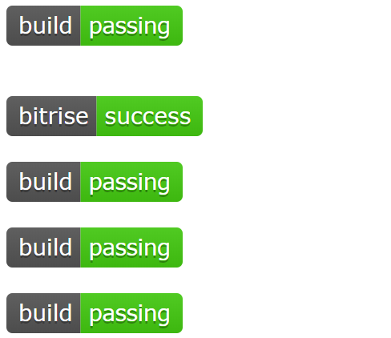

[TOC]

#  如何在github上写出漂亮的readme.md

## :black_nib: 问题描述:pencil2:

### :scream:别人写的readme文档竟如此漂亮:scream_cat:

最近自己利用hexo+github服务器搭建的个人博客域名到期，突发奇想直接用github page搭建自己的个人博客。以前采用hexo 搭建博客的缺点是，换一台电脑就不能用了，这是然人很烦恼的一件事。今天就去翻了翻大佬的github仓库，发现大佬一般是自己在github仓库的readme中做项目介绍。而且，大佬的项目介绍写的那个靓，如下图所示


花花绿绿的标签和图标，是不是看起来很赏心悦目:heart:

### :worried:再看看我写的readme文档:joy:


就不过多评价了，看起来是如此的刻板，条条款款到还是挺清晰的，哈哈哈，就是缺少色彩感了。看着让人容易犯困


## :thinking: 那么别人是如何写出那么好看的readme文档的呢:question:

### :+1: readme.md的介绍:+1:

github上的readme.md是采用markdown语言编写，markdown语言的特点是，其格式编写方便。并且兼容latex，latex是用于非常强大的排版能力与office并列，对于有编程基础的人并不陌生，其排版能力非常强大，在文本编辑过程中，可以不用鼠标。 

### :kissing_smiling_eyes:markdown的emoji编辑功能:kiss:

markdown除了类似latex的强大排版功能外，还具有emoji功能，那么它的表情功能怎么用呢？

```
:emoji:
```

markdown及github支持的表情有哪些呢？可以通过以下两个网站查

- [webfx](https://www.webfx.com/tools/emoji-cheat-sheet/)

- [emojipedia](https://emojipedia.org/)

### :whale:Shields.io 提供大量的标签 :feet:

readme项目说明文档中，有如下图的标签



这些标签是怎么来的呢？可以查阅[shields.io](shields.io)进行引用，其中，build pass等标签，很多都需要采用`travis CI 、Appvexyor CI或 Circle CI`进行运行检测 [^1]。

那么我们如何给自己的readme.md添加标签呢？查阅[shields.io](shields.io) 网站各个图标怎么引用

#### :maple_leaf: shields.io中有动态的图标

如下需要相应的平台支持,图标显示格式可以查阅[shields.io](shields.io) 

```
twitter follow        /twitter/follow/:user?label=Follow
github follow         /github/followers/:user?label=Follow
github license        /github/license/:user/:repo
```


#### :articulated_lorry: shield.io也有静态badge

##### 静态badge命名格式

```
https://img.shields.io/badge/<LABEL>-<MESSAGE>-<COLOR>
or
https://img.shields.io/static/v1?label=<LABEL>&message=<MESSAGE>&color=<COLOR>
```

#### :alarm_clock: Colors


#### :frog: 示例

license标签

```
 #静态badge图标
 #动态连接github仓库的图标
```


twitter标签

```
 #动态连接twitter账户的图标
 #采用社交图标
```


language标签

```
  #静态图标
```


 

Documentation标签

```

```


## :memo:License:sparkling_heart:

这个有关github上优美的readme编写介绍，由Hubery-Lee编写，喜欢:heart:请收藏给一个赞吧:thumbsup:

[^1]:travis CI 等均是持续式集成开发工具，其中travis CI是用户量最多的。Travis CI 提供的是持续集成服务（Continuous Integration，简称 CI）。它绑定 Github 上面的项目，只要有新的代码，就会自动抓取。然后，提供一个运行环境，执行测试，完成构建，还能部署到服务器。持续集成指的是只要代码有变更，就自动运行构建和测试，反馈运行结果。确保符合预期以后，再将新代码"集成"到主干。持续集成的好处在于，每次代码的小幅变更，就能看到运行结果，从而不断累积小的变更，而不是在开发周期结束时，一下子合并一大块代码。

Copyright :copyright:2019 [Hubery-Lee](https://github.com/Hubery-Lee)


